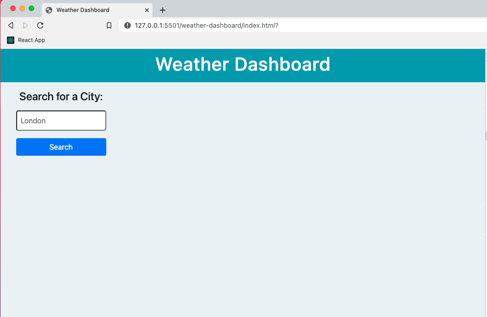
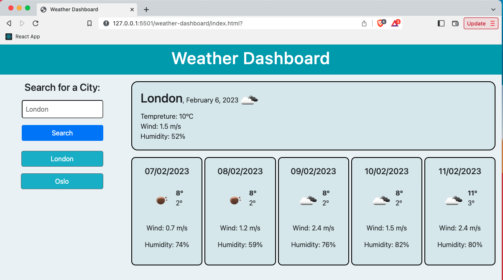
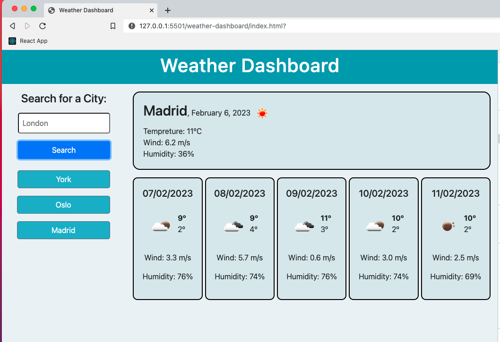

# Weather Dashboard

## The application is live at: https://ljenchik.github.io/weather-dashboard/

I used https://openweathermap.org/forecast5 to retrieve and display weather data for cities.

## Usage

  * When a user searches for a city they are presented with current and future conditions for that city and that city is added to the search history
  * When a user views the current weather conditions for that city they are presented with:
    * The city name
    * The date
    * An icon representation of weather conditions
    * The temperature
    * The humidity
    * The wind speed
  * When a user view future weather conditions for that city they are presented with a 5-day forecast that displays:
    * The date
    * An icon representation of weather conditions
    * The maximun and the minimum temperature of the day
    * The humidity
  * When a user click on a city in the search history they are again presented with current and future conditions for that city

